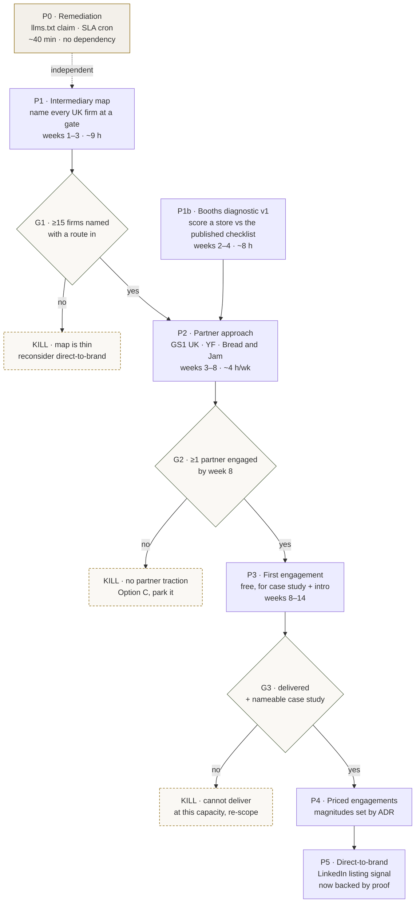

---
canon_sources:
  - projects/flintmere/decisions/0029-retail-gate-pivot.md
  - projects/flintmere/decisions/0019-strategic-gate-window-six-month.md
  - projects/flintmere/decisions/0022-audit-band-pricing.md
  - projects/flintmere/decisions/0027-shopify-catalog-ucp-stance.md
  - projects/flintmere/strategy/2026-04-26-final-report.md
  - projects/flintmere/BUSINESS.md
  - memory/VOICE.md
  - memory/marketing/audiences.md
canon_audit_run: 2026-09-06
binding: CLAUDE.md §Binding 2026-05-09 (canon protection)
parity_note: >
  The CLAUDE.md deliverable-parity check does not bind this spec — it defines
  no deliverable copy, and §7 defers all pricing to a later ADR. Parity applies
  the moment this spec specifies what a buyer receives.
status: draft — approved in direction by operator 2026-09-06; magnitudes pending
---

# Retail-gate pivot — execution spec

Executes ADR 0029. Covers the offer, the buyer, the distribution graph, the
gates and the kill criteria. Does **not** set final prices — ADR 0029 §4
re-opens the band magnitudes and defers them to a later ADR.

**Operating constraints, binding on every decision below:**

| Constraint | Value | Consequence |
|---|---|---|
| Operator capacity | < 10 h/week | ~40 h/month total, evenings and weekends |
| Warm network in UK food | none | No introduction path; cold entry only |
| Cash | £0 revenue, ~£130/mo burn | No paid acquisition, no event stands |
| Case studies | none | Cannot open with proof |
| Stated goal | replace income (~£4–5K/mo) | Needs ~£100–125/h across *all* hours |

---

## 1. The offer

**Flintmere prepares, structures and submits the product data a UK grocery
retailer or wholesale data pool requires, and carries the accuracy burden the
brand is contractually assigned.**

Not scoring. Not AI visibility. Not a Shopify app.

The three things being sold, ordered by what the buyer actually pays for:

1. **Knowledge of an unpublished schema.** Waitrose WPP, Sainsbury's EVOLVE,
   Ocado's Pro-Forma on Olive, Whole Foods' ingredient screen — every one sits
   behind a login. A brand cannot see the standard it is judged against until it
   is already inside.
2. **Carriage of accuracy liability.** Erudus' terms assign the manufacturer
   "sole responsibility for the legality, reliability, integrity, accuracy and
   quality of the Customer Data", with an indemnity attached and Erudus' own
   liability capped at £100,000.
3. **The work itself** — extraction from supplier PDFs and back-of-pack, mapping
   to the target schema, submission. This is the least valuable third, and the
   only one a competitor could copy cheaply.

**First product: the Booths gate.** Booths is the only UK retailer publishing
its full requirements as a free downloadable checklist. That makes it the one
gate a diagnostic can be built against without insider access, and therefore the
only place a v1 can be validated before any partner conversation. **Ocado is the
commercial target; Booths is the build target.**

---

## 2. The buyer

Amended from `memory/marketing/audiences.md`, which selects on SKU count *and*
revenue and thereby describes two different populations — a £500K–£20M food
*brand* carries 20–150 SKUs; only *retailers* carry 100–5,000. That contradiction
is resolved here.

**The buyer is a UK food or drink brand that has just won, or is actively
pursuing, a grocery or wholesale listing.** Not a SKU count. Not a revenue band.
A moment.

Buying signals, most reliable first:

- Publicly announced a new retail listing in the last 90 days
- Exhibiting or pitching at a Meet the Buyer event
- In a retailer accelerator cohort (Tesco Accelerator, The Apiary,
  BrandsNew, Brands on Ice)
- Newly GS1 UK-registered

**Non-buyers, explicitly:** DTC brands with no retail ambition; hobbyist and
sub-£250K producers; anyone whose question is "how do I get more Google traffic".

---

## 3. Why partner-first

Direct-to-brand requires a case study that does not exist, aimed at a population
of thousands with no visible signal of who is at the gate. Partner-first inverts
three things at once:

| | Direct to brand | Via intermediary |
|---|---|---|
| Nature of the ask | a sale (£800+, cold) | a supplier conversation |
| Counterparty's risk | their own money | one client |
| Case study needed | yes | no |
| Population size | thousands, unenumerable | ~20–50, enumerable |
| Repeat volume | one engagement | ongoing referral |

The intermediaries also already know the problem is real. They watch launches
slip on missing back-of-pack data and would rather not do the work themselves.

---

## 4. The dependency graph

**Reading the graph.** P0 is independent of everything and ships first because
it corrects a live false claim. P1 and P1b run in parallel and both feed P2 —
the map gives you who to talk to, the diagnostic gives you something to show
them. Every gate carries an explicit kill edge; none of them is "try harder".

---

## 5. Phases, gates and kill criteria

### P0 · Remediation — ~40 min, no dependency

1. Strip the present-tense ingestion-engine claim from
   `apps/scanner/src/app/llms.txt/route.ts:75` and `README.md:3`.
2. Disable the concierge SLA cron. **Do not delete the three `ConciergeAudit`
   rows** — clearing paid-order records is destructive and needs its own decision.

### P1 · Intermediary map — weeks 1–3, ~9 h

Enumerate every UK firm standing at a retail-onboarding gate. Partial map already
gathered (§6). For each: name, what they do at the gate, published partner route
if any, named contact, and whether they compete or complement.

**Gate G1 — ≥15 firms named with an identified route in.**
Kill: fewer than 15 means the intermediary layer is thinner than the research
suggests. Reconsider direct-to-brand before spending eight weeks on it.

### P1b · Booths diagnostic v1 — weeks 2–4, ~8 h

Score a brand's public product data against the Booths Retail Ready Checklist —
the only published UK retailer schema. Reuses `packages/scoring` fetch and parse;
replaces the seven-pillar model with checklist items.

Output is a one-page gap list naming actual products. This is the artefact a
partner conversation opens with.

### P2 · Partner approach — weeks 3–8, ~4 h/wk

Individually, never batched. The offer to a partner is: *take this off your hands
on one client, free, and see whether it's useful.*

**Gate G2 — at least one partner engaged by week 8**, meaning a named firm has
agreed to route one client, or has listed Flintmere as a supplier.
Kill: no partner traction by week 8 → ADR 0029 §Consequences, Option C. Park it,
stop the burn, write the closing ADR.

### P3 · First engagement — weeks 8–14

Free, explicitly in exchange for a nameable case study and one introduction.
Deliver entirely by hand. The pain of doing it manually is the requirements
document for anything automated later.

**Gate G3 — delivered, with a case study you may name.**
Kill: if a single engagement cannot be delivered inside the capacity, the service
shape is wrong at <10 h/week. Re-scope before selling another.

### P4 · Priced engagements

Magnitudes set by a subsequent ADR, per ADR 0029 §4. Not before G3.

### P5 · Direct-to-brand

Only after P4. The LinkedIn retail-listing signal — brands announcing new
listings — becomes usable once there is a case study behind the message.

---

## 6. Named targets (P1 seed)

Verified 2026-09-06. Partner routes, best first:

| Target | Route in | Cost | Note |
|---|---|---|---|
| **GS1 UK** | Partner programme, 3-stage approval | not published | Public partner finder, 58,000+ UK businesses. Sits on the standards layer. Also powers Bread & Jam. Highest leverage. |
| **Ocado Roots** | Programme team referral | free | ~140 brands, onboarding constantly. Per ADR 0029 Amendment 1, Roots does the commercial side and leaves the data work to the brand — so its population *is* the buyer, and the team has an aligned incentive to see them unstuck. **Gated on a case study:** one introduction, spend it loaded. |
| **YF (Young Foodies)** | Preferred Suppliers directory | free to brands | ~1,500-brand network. **Reviewed quarterly** — timing matters. Community membership explicitly excludes service providers; the supplier list is the only door. |
| **Bread & Jam** | Partnership enquiry | "suit your budget" | >50% of attending brands £250K+, >25% £1M+, 85% decision-makers. Festival at Business Design Centre, Islington. |
| **Scotland Food & Drink** | Affiliate membership | **£720/yr** (≤£1M) | 25+ provider directory, named service-provider contact. |
| **Tastebuds Collective** | Membership | **£100–£400/yr** | Trade directory in every tier. Norfolk/Suffolk. |
| **FDF** | Professional Affiliate | not published | **Ashbury is already listed** — validates the channel, and tells you a competitor owns it. |

**Adjacent, at the same moment:** EDI providers (XEDI — Stockport, publishes
pricing, has Ocado and Sainsbury's pages; Transalis — Portsmouth, strongest
grocery logos), category consultants (May Insight — explicitly serves start-ups
securing listings), retailer accelerators (Tesco Accelerator, The
Apiary, BrandsNew, Brands on Ice; Ocado Roots promoted to the table above).

**Do not pursue: pack-shot studios.** Nine were checked; none mentions Ocado,
Brandbank, NielsenIQ or GS1. Brandbank runs 100+ photographers across 15 in-house
studios, so spec photography is already absorbed by the data pool.

**Competitors to watch:** Ashbury (150+ regulatory experts, Normec group; writes
specs inside retailer systems, does *not* do data syndication), Food Compliance
Compass (Carlisle — names Aldi APP, Iceland Igloo, Foods Connected, Hamilton
Grant), SJW Technical (solo; lists nine retailer spec systems, **Ocado absent**),
Start with Data (London — sells exactly this model to B2B distribution,
electrical and automotive; **no food, no grocery**).

---

## 7. Pricing

Not set here. ADR 0029 §4 re-opens the ADR 0022 magnitudes and defers them.

What *is* decided: **the ladder stays published.** In the Shopify app market a
published £197–£597 ladder sat five to twenty times above the ceiling. In the
regulatory-consultancy market almost nobody publishes at all — across Ashbury,
Campden BRI, Leatherhead/Sagentia, RSSL, Food Alert, Nutritics, Erudus, Food
Compliance Compass and SJW Technical, the only published figures found were
Campden BRI's £1,300 + VAT associate floor and one Eurofins line item at £243.30.
A published price is now a differentiator, not a concession.

Two unknowns must close before magnitudes are set:

1. **Brandbank subscription pricing.** Unpublished; NielsenIQ has withdrawn
   supplier-facing commercial pages. It sets the reference price for the gate.
2. ~~**What Ocado Roots actually covers.**~~ **Closed 2026-09-10** — ADR 0029
   Amendment 1. Roots is commercial support only; the data work stays with the
   brand. No free competitor at this gate, so magnitudes are unblocked on this
   count.

---

## 8. What we are not doing

Enumerated so it stays decided:

- Fixing the Shopify embedded app. It has never compiled; there is no billing code.
- The ingestion engine as a build project. 9–12 months full-time is 4–5 years here.
- Persona landing pages, in any number.
- Paid acquisition of any kind.
- Chasing the ADR 0019 citation. Closed as Fail.
- Any agent framework, cloud-computer harness or new vendor.
- Event stands. Attendance at Speciality & Fine Food Fair (5–7 April 2027, ExCeL)
  is free; stands are not.

---

## 9. Open questions

- ~~Ocado Roots' actual scope~~ — **closed 2026-09-10**, ADR 0029 Amendment 1.
  Commercial support only; the data work stays with the brand.
- Brandbank subscription pricing — blocks pricing.
- Amazon UK's data gate — never verified; unknown, not absent.
- Whether the Booths checklist is representative enough of the other gates for a
  diagnostic built against it to generalise.

---

## 10. Reconciliation owed

Landing this spec leaves the following stale. Out of scope here; listed so they
are not lost:

- `CLAUDE.md` §Product snapshot — describes the ingestion engine as the
  centrepiece and the dead-inventory wedge as the conversion mechanic.
- `projects/flintmere/STATUS.md` — §Phase, §Known issues and §Changelog are four
  months stale; several `⏸ pending` rows are verifiably false (standards
  subdomain is live, the PostHog key is real, legal pages serve 200, and the
  droplet is `178.105.38.117`, not `134.122.102.159`).
- `projects/flintmere/BUSINESS.md` — revenue goals assume the subscription ladder.
- `memory/marketing/audiences.md` — the SKU/revenue contradiction resolved in §2,
  plus the stale £399 Agency price and "Enterprise" naming already flagged in its
  own changelog.
- `memory/canon-source-register.md` — cites nine `feedback_*.md` files that do not
  exist, so the CLAUDE.md binding degrades silently on every dispatch.
